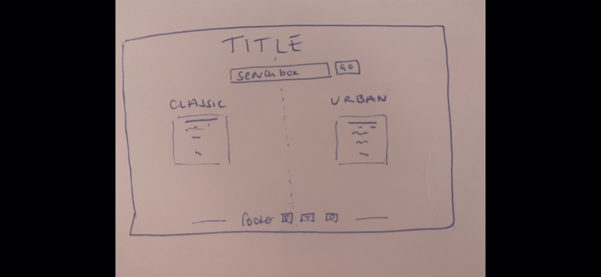
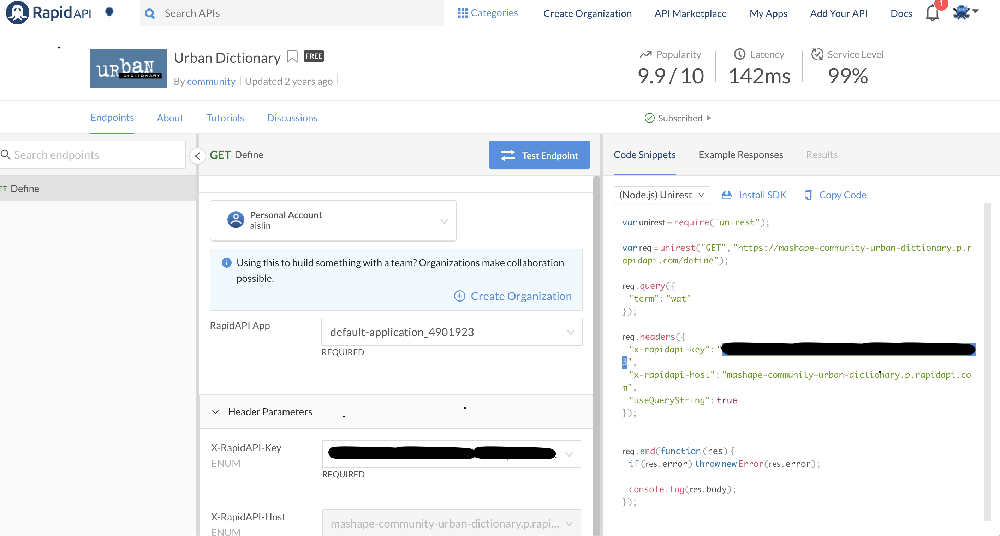
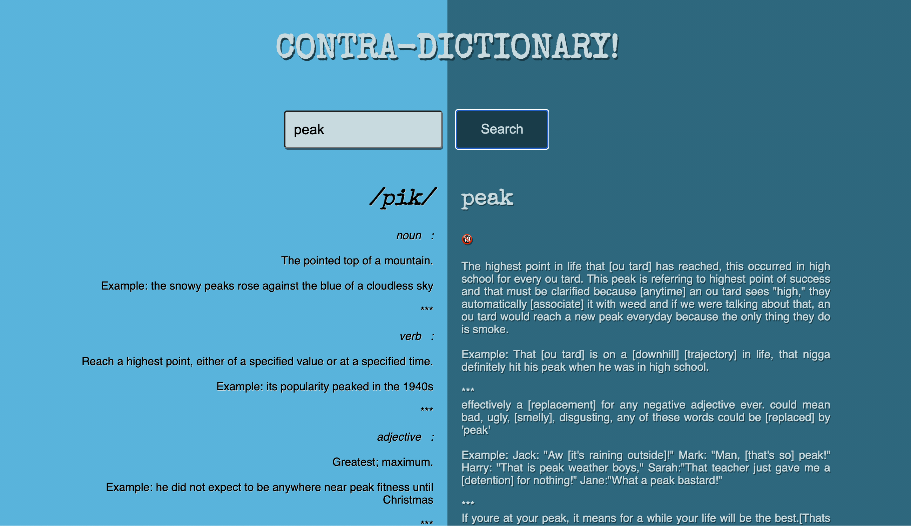

# 📚 *ContraDictionary*🔍

A surprise, two-day hackathon for General Assembly’s Software Engineering Immersive course. 

### The Team:

* Aislin Bamber -  [GitHub](https://github.com/aislinb) 
* Sandra Spighel -  [GitHub](https://github.com/hotsauceninja) 

### Deployment

This website was deployed using Netlify and is available  [here](https://contra-dictionary.netlify.app). 

### Brief 

In pairs, we were required to build a React.js application, which consumed a public API, and displayed it on a custom front-end. 

*Requirements:* 
* *Consume a public API* – this could be anything but it must make sense for your project
* *Have several components* - At least one classical and one functional
* *The app should include a router* - with several “pages”
* *Include wireframes* - that you designed before building the app
* *Be deployed online* and accessible to the public

### Technologies We Used
* *APIs*:
	*  [Google Dictionary API](https://github.com/meetDeveloper/googleDictionaryAPI)  
	*   [Urban Dictionary API](https://rapidapi.com/community/api/urban-dictionary) 
* *Front-end*:
	* CSS3 + SASS
	* HTML5
	* JavaScript (ES6)
	* React.js
	
* *Dependencies*:
	* Axios
	* react-router-dom
	* yarn

* *Development Tools*:
	* Eslint
	* Git + GitHub
	* Google Fonts
	* Heroku
	* Insomnia
	* VS Code

### How To Install
1. Clone the project from GitHub onto your machine
2. Use `yarn` or `npm` to install dependencies from the package.json file
3. Start the server:  `yarn start`

### Concept

In our pair, we researched which public APIs were available for us to use for no cost and, more importantly, provided clear documentation of how to implement them. Whilst Googling around, we saw that there were quite a few options for dictionaries, also falling upon the Urban Dictionary API. This led us to the idea of comparing the two side-by-side in a simple, clean-looking single-page application, with one search field returning results from two APIs, providing the user with the traditional and slang definitions. 

Many of the APIs required a long-winded authorisation process in order to be issued with the keys be able to use them, so we decided upon the Google Dictionary for both simplicity and speed.

### Planning

We developed quick wireframe sketches of how the application would look to present to our instructor for sign-off, and moved on quickly to most tricky part which was working with our APIs.




We were required to sign up to Rapid API for the Urban Dictionary API usage rights in order to retrieve the secret key. 




### Process

After creating our front-end we created an .env file in which to store our secret key, and set about fetching our data using Axios:

```
const baseUrlUrbanDictionary = 'https://mashape-community-urban-dictionary.p.rapidapi.com/define'

export function getUrbanDictionaryDefinition(wordSearched) {
  return axios({
    method: 'GET',
    url: baseUrlUrbanDictionary,
    params: { term: wordSearched },
    headers: {
      'x-rapidapi-key': process.env.REACT_APP_MY_URBAN_API_KEY,
      'x-rapidapi-host': 'mashape-community-urban-dictionary.p.rapidapi.com',
    },
  })
}

```

Keeping components separate made the first experience of building a project with React much easier, so we destructured the search form into its own component, too: 

```
function SearchForm({ setSearchTerm }) {

  const [ formdata, setFormdata ] = React.useState('')
  const handleChange = (event) => {
    setFormdata(event.target.value)
  }

  const handleSubmit = (event) => {
    event.preventDefault()
    setSearchTerm(formdata)
  }

  return (
    <div className="search-box"> 
      <form onSubmit={handleSubmit}>
        <input 
          className="input-field"
          placeholder="Search for a word"
          onChange={handleChange}
        />
        <button type="submit" className="button">Search</button>
      </form>
    </div>
  )
}
```


The structure of the Classic Dictionary’s API was slightly harder and it took us a while to get the definitions we required onto the page, as its structure required us to map through the meanings and then the definitions within those meanings, as below:

```
function ClassicWordDefinition({  phonetics, meanings }) {
  return (
    <>    
      <div className="dictionary-content">
        <h2 id="title-font"> &nbsp; <em>{phonetics[0].text}</em></h2>
        <div className="definitions">
          {meanings.length > 0 ? 
            meanings.map((meaning, index) => (
              <div key={index}>
                <em>{meaning.partOfSpeech} &nbsp; :</em>
                <div><br/></div>
                {meaning.definitions.map(definition => (
                  <div key={definition.definition}>
                    {definition.definition}
                    <div><br/></div>
                    {definition.example ?
                      (<div> Example: {definition.example} </div>) 
                      :
                      <div></div>}
                    <div><br/></div>
                    <div>***</div>
                  </div>
                ))}
                <div><br/></div>
              </div>
            ))
            :
            <div>
              <br></br><i>We are cheapskates so the free dictionary that we are accessing does not have an entry for this word 😭 </i>
            </div>
          }
        </div>
      </div>
    </>
  )
}
export default ClassicWordDefinition

```
* We worked through the project pair-programming for all of the API and React coding, mainly because we weren't as confident and felt that two heads were better than one. It also meant that we both gained a full understanding of how we were fetching our data in order to manipulate it properly. 
* One we were happy with our general page functionality and the API access, we decided to work on separate components of styling with CSS in order to save time. Still available to chat to each other over Zoom and Slack, we worked on our own versions of the project updating each other when we'd achieved something we were happy with and wanted to include in the final version. 
* Since this was such a quick and relatively small project, (most of it being built through pair-programming, also), we decided against using the VS Code live share option. We instead just took it in turns to code, with the other observing the screen over Slack. This worked pretty well for this 48 hour period, and meant we didn't have to waste valuable time with the setup and learning of this way of working. I think if the project had been any longer however, we would have definitely made use of this feature. 
### Insomnia 
Insomnia was a new tool for us but it quickly became invaluable in working out the bits of data we wanted to use, how nested those were, and how many fields we wanted to render on the page. 



### Wins
* Teamwork:
This was our first experience with pair-coding which was a real adjustment  in terms of how I was used to troubleshooting.  We had great communication so were able to adapt the pace to each others needs as and when it was required.
* We made sure we shared the work by taking it in turns to code using the screen share function on Zoom 
*  It was also excellent practice in trying to keep our syntax uniform, using the same naming convention styles, etc., and also being able to explain our thought processes and the logic behind our code when working through problems
* Refactoring - I was very pleased with how we kept code simple and easy to read, by organising into a few smaller components. 
* MVP - we kept the Minimum Viable Product simple and clean, as we wanted to really concentrate on consolidating the knowledge we’d gained throughout the previous week and get to grips with React and manipulating data. I think this worked really well - we delivered a complete product that was aligned with the brief and had decent styling, too. Playing it safe built some much needed confidence at this tiring stage in the course!

### Challenges
* We wasted a fair bit of time at the beginning of the project searching for appropriate APIs
* I’d say this was still a valuable lesson as it just required us to problem solve and find answers for ourselves 

### Key Learnings
* I learnt a lot through this first ever pair-programmed exercise, particularly in how important it is to communicate clearly the thought processes behind each bit of logic. 
* The importance of pseudo code and annotation throughout this project helped keep things clear and organised

### Future features
* I would like to be able to add a "random" buttom where a randomly chosed word it generated and returns the two definitions from the API. 

